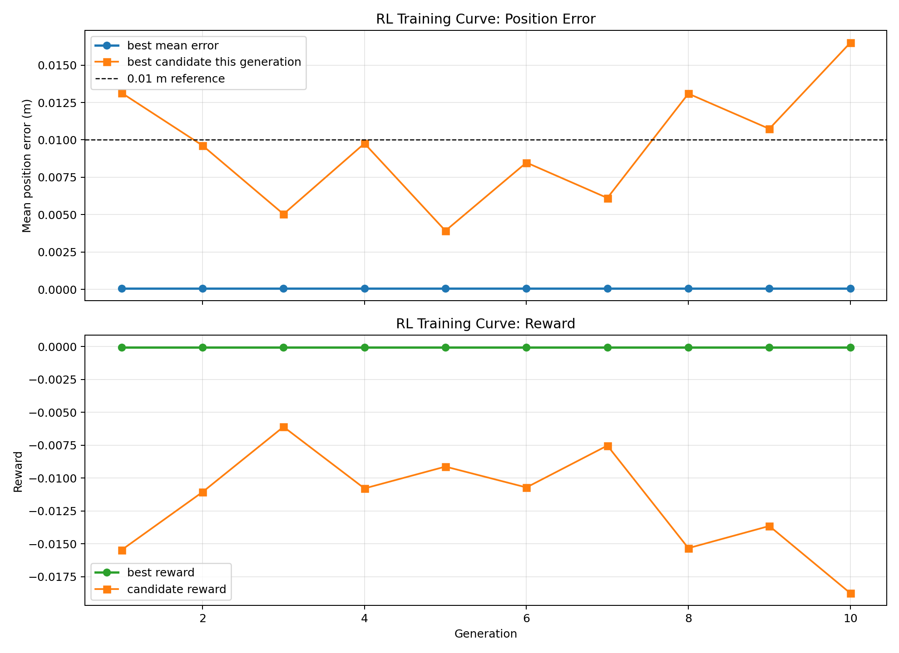
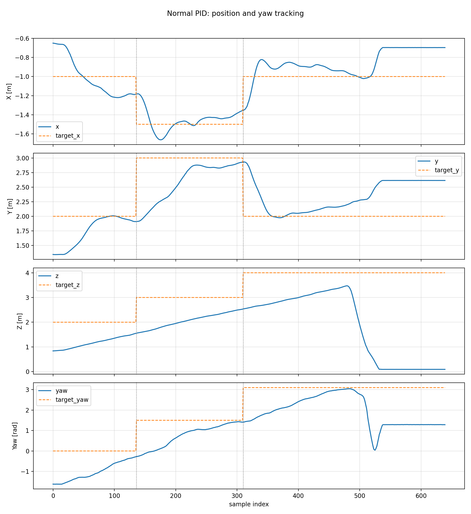
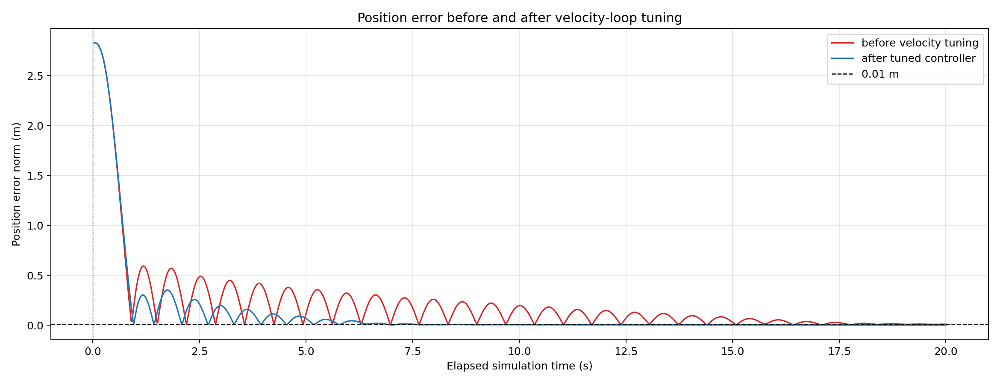
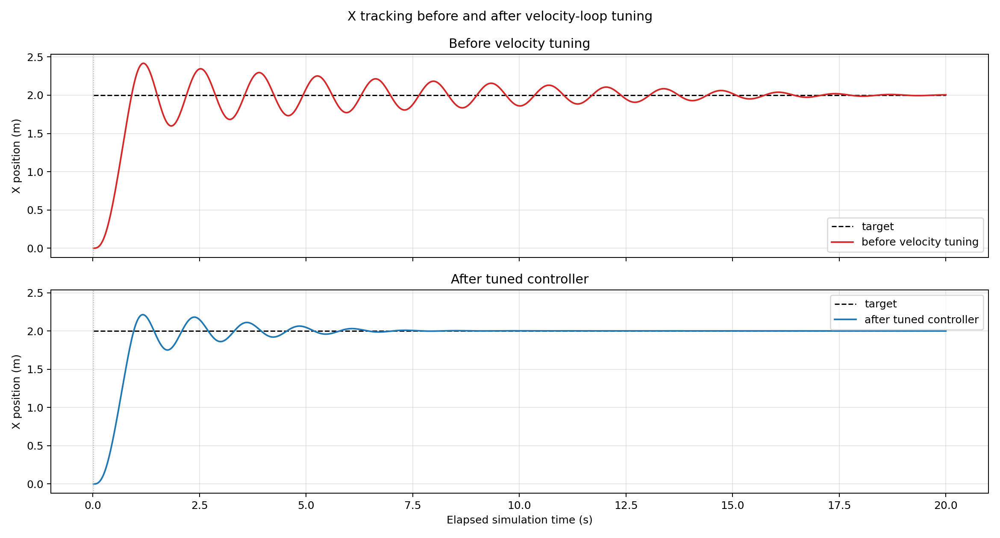
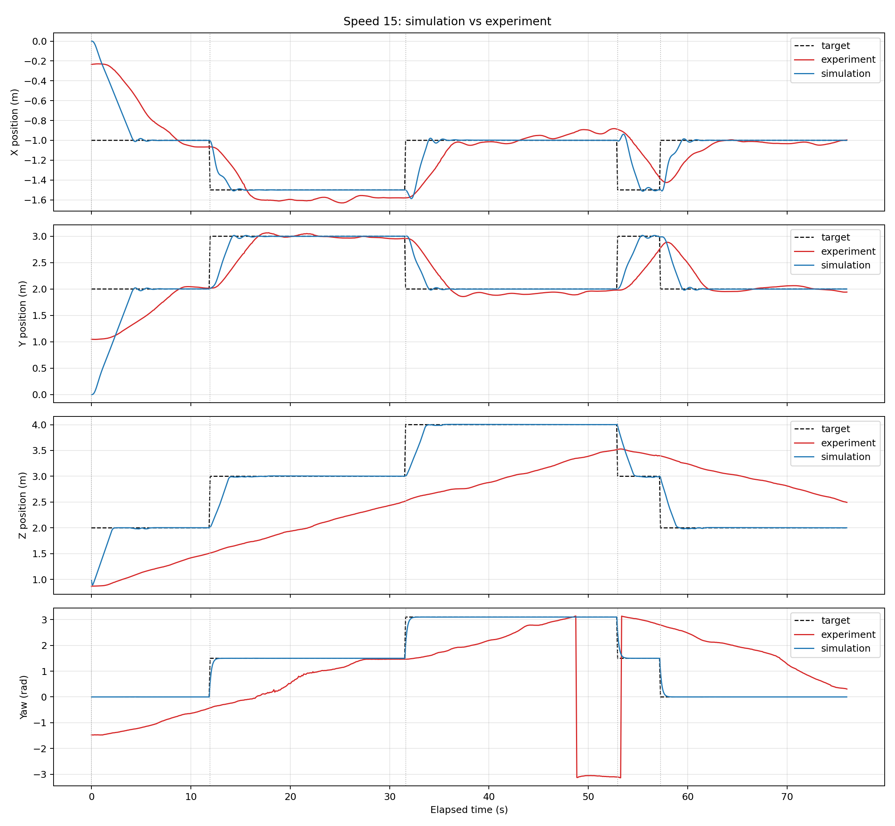
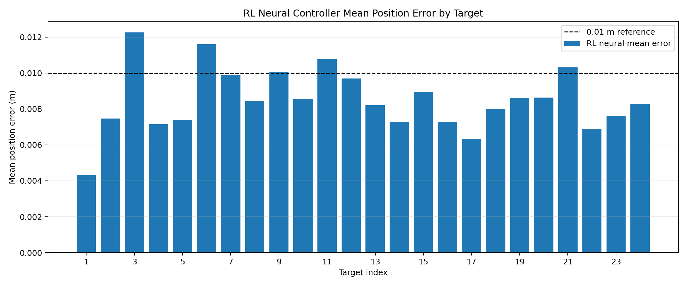
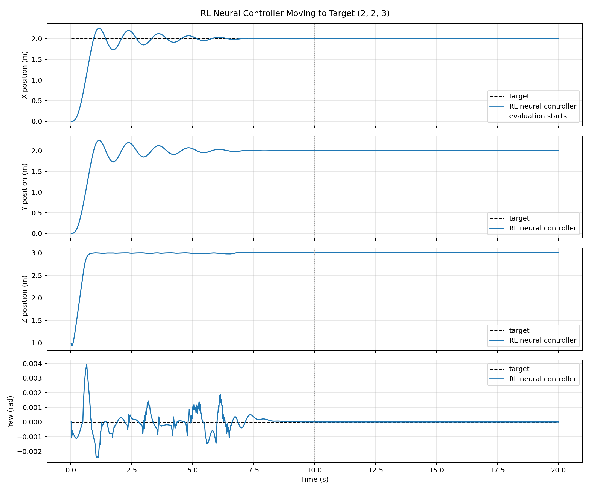
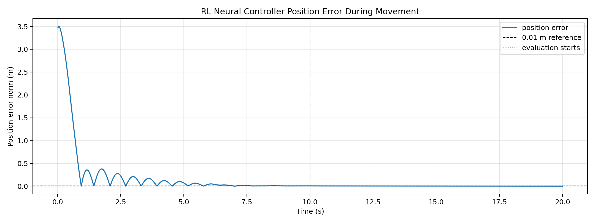
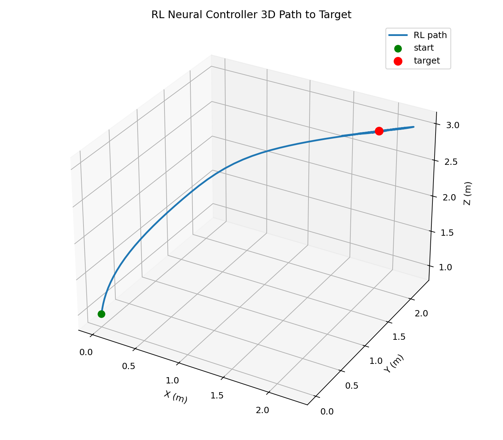

<h1 align="center">Drone PID and RL Controllers</h1>

<p align="center">
  Tello drone simulation controllers comparing a classical PID-style approach with a neural reinforcement-learning policy.
</p>

<p align="center">
  
  
  
  
</p>

---

## Overview

This repository contains two controller approaches for a Tello drone simulator:

| Controller | File | Purpose |
|---|---|---|
| PID-style controller | `controllers/controller_pidlab.py` | Classical controller with CSV logging |
| Neural RL controller | `controllers/controller_rl_neural.py` | Trained residual neural policy for velocity commands |

Both controllers use the same simulator-facing API:

```python
controller(state, target_pos, dt, wind_enabled=False)
```

and return:

```python
(vx_cmd, vy_cmd, vz_cmd, yaw_rate_cmd)
```

The controllers do not directly command motors. They output velocity and yaw-rate commands, which are then handled by the simulator's lower-level Tello controller.

---

## Key Results

### Neural RL Controller

The neural policy was tested on the 24 assignment targets in PyBullet.

| Metric | Result |
|---|---:|
| Overall mean position error | `0.00850 m` |
| Worst target mean error | `0.01226 m` |
| Targets over `0.01 m` | `5 / 24` |

The tuned classical cascaded controller remained more accurate, but the RL controller successfully demonstrates a working neural policy pipeline.

---

## Preview Plots

### RL Training Curves



### PID Tracking Overview



### Velocity Tuning Before and After

| Position Error | X Response |
|---|---|
|  |  |

### Simulation vs Experiment



### RL Neural Controller Error



### RL Neural Controller Moving to Target

| Time Response | Position Error |
|---|---|
|  |  |



---

## RL Policy Design

The neural controller uses a compact actor network:

```text
12 input features -> 12 tanh hidden neurons -> 4 output actions
```

Input features include:

```text
body-frame position error
estimated velocity
yaw error
integral memory terms
```

Output actions:

```text
vx_cmd
vy_cmd
vz_cmd
yaw_rate_cmd
```

The policy is implemented as a residual neural controller. A stable base policy provides safe initial commands, and the trained neural network adds a learned correction.

---

## Training Setup

Training script:

```text
training/train_rl_neural_policy.py
```

Saved weights:

```text
training/rl_neural_policy_weights.json
```

Training method:

```text
Cross-Entropy Method / evolutionary policy search
```

Training configuration:

```text
10 generations
40 candidate policies per generation
8 target episodes per candidate
approximately 3200 training episodes
```

The reward penalised position error, yaw error, final error, and excessive control effort.

---

## Repository Structure

```text
drone-pid-rl-controllers/
+-- controllers/
|   +-- controller_pidlab.py
|   +-- controller_rl_neural.py
+-- training/
|   +-- train_rl_neural_policy.py
|   +-- rl_neural_policy_weights.json
+-- results/
|   +-- rl_neural_assignment_summary.csv
+-- reports/
|   +-- RL_Controller_Report.md
+-- plots/
|   +-- pid_tracking_overview.png
|   +-- velocity_tuning_position_error.png
|   +-- velocity_tuning_x_stacked.png
|   +-- simulation_vs_experiment_speed15.png
|   +-- rl_neural_mean_error_by_target.png
|   +-- rl_training_curves.png
|   +-- rl_neural_moving_to_target_time_response.png
|   +-- rl_neural_moving_to_target_position_error.png
|   +-- rl_neural_3d_path_to_target.png
+-- README.md
```

---

## Report

For a more detailed explanation of the RL controller, training process, and results, see:

[`reports/RL_Controller_Report.md`](reports/RL_Controller_Report.md)
